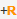
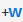
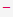
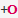

# Aquascope
Aquascope ist ein Tool, das interaktive Visualisierungen von Rust-Programmen erzeugt. Diese Visualisierungen zeigen das Kompilierungs- und Laufzeit-Verhalten von Rust Programmen.


## Visualisierung
Aquascope stellt einen mdBook Präprocessor dar der Aquascope-Diagramme in ein mdBook integriert.
Das folgende Bild zeigt eine Beispielvisualisierung:


#### Bedeutung
-  Die Variable wird in dieser Zeile initialisiert.
-  Die Variable wird nach dieser Zeile nicht mehr verwendet.
-  Die Resource wird in dieser Zeile geborrowed.
-  Die Variable hatte bisher keine Read-Berechtigung erhällt diese aber in dieser Zeile.
-  Die Variable hatte bereits Read-Berechtigungen und es findet keine Änderung daran statt.
-  Die Variable hatte zuvor Read-Berechtigungen, aber verliert diese jetzt.
-  Die Variable hatte bisher keine Write-Berechtigung und es findet keine Änderung daran statt.
-  Die Variable hatte bisher keine Write-Berechtigung erhällt diese aber in dieser Zeile.
-  Die Variable hatte zuvor Write-Berechtigungen, aber verliert diese jetzt.
-  Die Variable hatte bisher kein Ownership über die Resource und es findet keine Änderung daran statt.
-  Die Variable hatte bisher kein Ownership über die Resource erhällt dies aber in dieser Zeile.
-  Die Variable hatte zuvor Ownership über die Resource, aber verliert dies jetzt.

## Installation
Die Installation ist momentan nur bedingt möglich. Zudem funktioniert das Tool momentan nur auf Linux-Systemen. Die momentan aktuellste Version, die sich installieren lässt ist ``v0.3.1``.
````shell
cargo install mdbook-aquascope --locked --version 0.3.1
rustup toolchain install nightly-2023-08-25 -c rust-src rustc-dev llvm-tools-preview miri
cargo +nightly-2023-08-25 install aquascope_front --git https://github.com/cognitive-engineering-lab/aquascope --tag v0.3.1 --locked
cargo +nightly-2023-08-25 miri setup
````
Die Installation from Source bietet dabei nur den Vorteil den [Playground](https://cognitive-engineering-lab.github.io/aquascope/) lokal laufen lassen zu können. Dieser lässt sich aber in der Version ``v0.3.1`` nicht bauen. Somit wird diese Installationsform hier nicht beleuchtet.
Um die Installation zu erleichtern wird ein Dockercontainer bereitgestellt.
````shell
~/tools$ docker compose up aquascope
````

## Benutzung
Aufgrund mangelnder Dokumentation der Annotation und generellen Bedienung des Tools sowie Fehlern im Tool selbst funktioniert die lokale Installation im bereitgestellten Dockercontainer nicht. Deshalb ist auf den [Playground](https://cognitive-engineering-lab.github.io/aquascope/) zurückzugreifen. Da das Tool Forschungssoftware ist und unter Entwicklung ist kann davon ausgegangen werden, dass diese Probleme in Zukunft behoben werden.

## Evaluierung
1. Vorteile
    - Zumindest im Playground findet alles komplett automatisiert statt.
2. Probleme
    - In der Stack-Darstellung werden momentan nicht alle Ownership-Fehler gefunden/dargestellt die der Rust-Borrow-Checker findet. Beispiel:
        ````rust
        fn main() {
          let mut a = 1;
          foo(&mut a);
        }
        
        fn bar(x: &mut i32) {}
        fn foo(a: &mut i32) {
            let y = &a;
            bar(a);
            println!("{}", y);
        }
        ````
         > Vom Borrow-Checker gefundener Fehler:
         ````shell
            error[E0502]: cannot borrow `*a` as mutable because it is also borrowed as immutable
              --> src/main.rs:12:5
               |
            11 |     let y = &a;
               |             -- immutable borrow occurs here
            12 |     bar(a);
               |     ^^^^^^ mutable borrow occurs here
            13 |     println!("{}", y);
               |                    - immutable borrow later used here
            
         ````
    - Aus der unter Visualisierung beschriebenen Codeannotation können manchmal solche Fehler abgelesen werden, jedoch benötigt es dafür viel Geduld. Oft gelingt dies aber gar nicht.
    - Es werden nicht immer alle Codezeilen im Playground annotiert. Manchmal wird aber auch die Annotation mehrerer Zeilen zusammengefasst. Dies macht es unübersichtlich oder oft auch einfach unverständlich.
    - Die Art der Codeannotationen kann für Anfänger sehr Verwirrend sein und trägt nicht unbedingt dazu bei, die Ownership-Verhältnisse zu verstehen.
3. Fazit <br>
Das Tool bringt durchaus Vorteile gegenüber einer reinen Shell basierten Fehlerauswertung, jedoch überwiegen im momentanen Zustand klar die Nachteile. Da das Tool aber noch aktiv entwickelt wird, kann es durchaus sein, dass diese Probleme in zukünftigen Versionen behoben werden.
