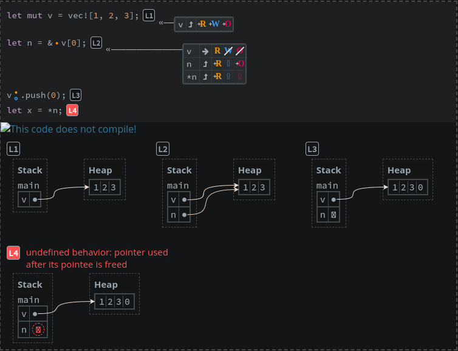

# Aquascope
[Aquascope](https://github.com/cognitive-engineering-lab/aquascope) ist ein Tool, das interaktive Visualisierungen von Rust-Programmen erzeugt. Diese größtenteils automatisch generierten Visualisierungen zeigen das Kompilierungs- und Laufzeit-Verhalten von Rust Programmen.
<br>

## Visualisierung
Aquascope stellt einen [mdBook](https://rust-lang.github.io/mdBook/) Präprozessor dar der Aquascope-Diagramme in ein mdBook integriert.
Das folgende Bild zeigt eine Beispielvisualisierung: <br>


#### Symbol-Bedeutungen
|                Kategorien                | Typen                                                                                                                                                                                                                                                                                                                                                                                                                                                                   |
|:----------------------------------------:|:------------------------------------------------------------------------------------------------------------------------------------------------------------------------------------------------------------------------------------------------------------------------------------------------------------------------------------------------------------------------------------------------------------------------------------------------------------------------|
|            Read-Berechtigung             |  Die Variable hatte bisher keine Read-Berechtigung erhällt diese aber in dieser Zeile.<br> Die Variable hatte bereits Read-Berechtigungen und es findet keine Änderung daran statt.<br> Die Variable hatte zuvor Read-Berechtigungen, aber verliert diese jetzt.                                                                   |
|            Write-Berechtigung            |  Die Variable hatte bisher keine Write-Berechtigung und es findet keine Änderung daran statt. <br> Die Variable hatte bisher keine Write-Berechtigung erhällt diese aber in dieser Zeile. <br> Die Variable hatte zuvor Write-Berechtigungen, aber verliert diese jetzt.                                                 |
|            Owner-Berechtigung            |  Die Variable hatte bisher kein Ownership über die Resource und es findet keine Änderung daran statt.<br> Die Variable hatte bisher kein Ownership über die Resource erhällt dies aber in dieser Zeile.<br> Die Variable hatte zuvor Ownership über die Resource, aber verliert dies jetzt.                              |
| Gründe für ein<br> Berechtigungsänderung |  Die Variable wird in dieser Zeile initialisiert.<br> Die Variable wird nach dieser Zeile nicht mehr verwendet.<br> Die Resource wird in dieser Zeile borrowed.<br> Die Resource erhällt in dieser Zeile ihre Berechtigungen zurück.                                        |
|         Erwartete Berechtigungen         |  Es wird vor erwartet, dass die Ressource vor der durchgeführten Aktion die Read-Berechtigung hält.<br> Es wird vor erwartet, dass die Ressource vor der durchgeführten Aktion die Write-Berechtigung hält.<br> Es wird vor erwartet, dass die Ressource vor der durchgeführten Aktion das Ownership hält. |
<br>

## Installation
Die Installation ist momentan nur bedingt möglich. Zudem funktioniert das Tool momentan nur auf Linux-Systemen. Die momentan aktuellste Version, die sich installieren lässt, ist ``v0.3.1``.
````shell
cargo install mdbook
cargo install mdbook-aquascope --locked --version 0.3.1
rustup toolchain install nightly-2023-08-25 -c rust-src rustc-dev llvm-tools-preview miri
cargo +nightly-2023-08-25 install aquascope_front --git https://github.com/cognitive-engineering-lab/aquascope --tag v0.3.1 --locked
cargo +nightly-2023-08-25 miri setup
````
Die Installation from Source bietet dabei nur den Vorteil den [Playground](https://cognitive-engineering-lab.github.io/aquascope/) lokal laufen lassen zu können. Dieser lässt sich aber in der Version ``v0.3.1`` nicht bauen. Somit wird diese Installationsform hier nicht beleuchtet.
Um die Installation zu erleichtern wird ein Dockercontainer bereitgestellt.
````shell
~/tools$ docker compose up aquascope
````
<br>

## Benutzung
Die einfachste Möglichkeit Aquascope zu verwenden ist der zugehörige [Playground](https://cognitive-engineering-lab.github.io/aquascope/).

Um Aquascope bei einer lokalen Installation verwenden zu können muss zuerst (falls noch nicht geschehen) in dem jeweiligen Projekt ein [mdBook](https://rust-lang.github.io/mdBook/) erstellt werden:
````shell
~/project$ mdbook init <book-name>
````
Danach muss Aquascope in der `book.toml` Datei des mdBook's aktivieren. Dies geschieht durch Einfügen der folgenden Codezeile:
````toml
[preprocessor.aquascope]
````
Im Anschluss daran kann der annotierte Aquascope-Codeblock in einer der Markdown Quell-Files eingefügt werden:
````markdown
```aquascope,permissions,stepper,boundaries,shouldFail,horizontal
#fn main() {
let mut v = vec![1, 2, 3];`[]`
let n = &v[0];`[]``(focus,paths:v)`
v.push(0);`[]``{}`
let x = *n;`[]`
#}
```
````
Die Visualisierung lässt sich dann mit der Ausführung der folgenden Befehle im mdBook-Ordner generieren:
````shell
mdbook build
mdbook serve
````
### Syntax
1. Blockannotationen

   | Annotation    | Bedeutung                                                                                                                                                                                                                                                                               |
   |:--------------|:----------------------------------------------------------------------------------------------------------------------------------------------------------------------------------------------------------------------------------------------------------------------------------------|
   | aquascope     | Mit dieser Annotation aktiviert man den Aquascope Präprozessor auf dem Codeblock                                                                                                                                                                                                        |
   | interpreter   | Mit dieser Annotation aktiviert man die Interpreter-Zeilenannotationen.                                                                                                                                                                                                                 |
   | permissions   | Mit dieser Annotation aktiviert man die im Kapitel Visualisierung vorgestellten Berechtigungen. Dies muss zusammen mit `stepper` oder `boundaries` verwendet werden um die Visualisierung zu beeinflussen.                                                                              |
   | stepper       | Mit dieser Annotation aktiviert man das Anzeigen der zeilenweisen Stepper-Boxen . Benötigt die Annotation `permissions`.                                                                                                                      |
   | boundaries    | Mit dieser Annotation aktiviert man das Anzeigen der erwarteten Berechtigungen ,, . Benötigt die Annotation `permissions`. |
   | shouldFail    | Mit dieser Annotation können Codeblöcke mit dem `interpreter` verarbeitet werden, die nicht kompilierbar sind.                                                                                                                                                                          |
   | horizontal    | Mit dieser Annotation lässt sich die Ausrichtung der Stack- und Heap-Darstellung des `interpreter` von vertikal (default) zu horizontal ändern.                                                                                                                                         |
   | concreteTypes | Mit dieser Annotation lassen sich in der Stack- und Heap-Darstellung des `interpreter` zusätzlich die konkreten Datentypen anzeigen.                                                                                                                                                    |

2. Zeilenannotationen

   | Annotationen  | Bedeutung                                                                                                                                                                                                                                                                                                                                                                                                                                                                                                                                                                                                                                                                                                                                                                                                                                                                                                                                                            |
   |:--------------|:---------------------------------------------------------------------------------------------------------------------------------------------------------------------------------------------------------------------------------------------------------------------------------------------------------------------------------------------------------------------------------------------------------------------------------------------------------------------------------------------------------------------------------------------------------------------------------------------------------------------------------------------------------------------------------------------------------------------------------------------------------------------------------------------------------------------------------------------------------------------------------------------------------------------------------------------------------------------|
   | `#`           | Mit dieser Annotation am Zeilenanfang lassen sich einzelne Zeilen in der Ausgabe verstecken. Zur evaluierung werden diese trotzdem verwendet.<br>Beispiel: `` #fn main() { ``                                                                                                                                                                                                                                                                                                                                                                                                                                                                                                                                                                                                                                                                                                                                                                                        |
   | `` `[]` ``    | Mit dieser Annotation am Zeilenende lassen sich einzelne Zeilen in der Ausgabe zu der Stack- und Heap-Darstellung hinzufügen. Benötigt die `interpretet` Blockannotation.<br>Beispiel: `` let n = &v[0];`[]` ``                                                                                                                                                                                                                                                                                                                                                                                                                                                                                                                                                                                                                                                                                                                                                      |
   | `` `{}` ``    | Mit dieser Annotation am Zeilenende lassen sich in einzelnen Zeilen in der Ausgabe die Symbole der erwarteten Berechtigungen zu ihren alphabetischen Gegenstücken ändern. Benötigt die `boundaries` und `permissions` Blockannotation.<br>Beispiel: `` let n = &v[0];`{}` ``                                                                                                                                                                                                                                                                                                                                                                                                                                                                                                                                                                                                                                                                                         |
   | `` `(...)` `` | Mit dieser Annotation am Zeilenende lässt sich das Anzeigeverhalten der Stepper-Boxen anpassen. Dabei wird zwischen drei unique keys unterschieden, welche durch `,` und ohne Leerzeichen voneinander getrennt werden.<br><br> <ul><li>`focus`: Nur Zeilen die mit diesem Key annotiert sind zeigen in der Ausgabe die Stepper-Box an. Wenn keine Zeilen damit annotiert sind werden Alle angezeigt.</li><li>`paths`: Nur die Variable die mit diesem Key gekennzeichnet ist (Beispiel: `` `(paths:x)` ``) wird in der Stepper-Box per default angezeigt. Alle anderen Variablen sind dann in einem ausklappbaren Menü verborgen.</li><li>`rxpaths`: Ist von der Funktionalität gleich wie der Key `paths`, nur das der String hinter dem `:` hierbei als Regex evaluiert wird. Somit ist hiermit eine Auswahl mehrerer Variablen möglich.</li></ul><br>Benötigt die `stepper` und `permissions` Blockannotation.<br>Beispiel: `` let n = &v[0];`(focus,paths:v)` `` |

### Verwendung des Docker Containers
Zum Erstellen der Visualisierung mithilfe des Docker Containers müssen die Markdown Quell-Files mit den annotierte Aquascope-Codeblöcken im Ordner [/tools/aquascope/markdowns](markdowns) oder einem beliebigen Unterordner abgelegt werden und danach der folgende Befehl ausgeführt werden.
````shell
docker compose up aquascope
````
<br>

## Evaluierung
1. Vorteile
    - Playground: Die Visualisierung findet automatisch statt. Dabei muss man über kein Wissen zu Annotation verfügen und kann den eigenen Code per Copy-and-paste evaluieren lassen.
    - Lokale Installation: Auch hier wird die Visualisierung größtenteils automatisch vorgenommen. Es wird zwar eine extra annotation des Codes benötigt, aber meist langt dafür die oben im Beispiel angeführte Standard-Blocknotation.
    - Unausführbarer Code: Aquascope setzt für die Visualisierung nicht voraus, dass der Code kompilierbar ist.
2. Probleme
    - Manche Fehler werden nicht richtig oder erst zu spät erkannt. Beispiel:
        ````rust
            fn main() {
                let mut v = vec![1, 2, 3];
                let n = &v[0];
                v.push(0);
                let _x = *n;
            }
        ````
        > Aquascope erkennt hier erst einen Fehler bei <code>let _x = *n; </code>, jedoch passiert der erste Fehler schon eine Zeile früher bei <code>v.push(0); </code> da <code>v</code> hier mutable borrowed wird aber davor bereits immutable borrowed wurde und dies Regeln für Ownership und Borrowing verletzt.<br>Vom Borrow-Checker gefundener Fehler:
        ````shell
            error[E0502]: cannot borrow `v` as mutable because it is also borrowed as immutable
             --> src/main.rs:4:3
              |
            3 |   let n = &v[0];
              |            - immutable borrow occurs here
            4 |   v.push(0);
              |   ^^^^^^^^^ mutable borrow occurs here
            5 |   let _x = *n;
              |            -- immutable borrow later used here
        ````
    - In der Stack-Darstellung werden momentan nicht alle Ownership-Fehler gefunden/dargestellt die der Rust-Borrow-Checker findet. Beispiel:
        ````rust
        fn main() {
            let mut a = 1;
            foo(&mut a);
        }
        
        fn bar(x: &mut i32) {}
        fn foo(a: &mut i32) {
             let y = &a;
             bar(a);
             println!("{}", y);
        }
        ````
        > Aquascope erkennt in diesem Code keinen Ownership- oder Borrowing-Fehler<br>Vom Borrow-Checker gefundener Fehler:
        ````shell
            error[E0502]: cannot borrow `*a` as mutable because it is also borrowed as immutable
              --> src/main.rs:12:5
               |
            11 |     let y = &a;
               |             -- immutable borrow occurs here
            12 |     bar(a);
               |     ^^^^^^ mutable borrow occurs here
            13 |     println!("{}", y);
               |                    - immutable borrow later used here
            
        ````
    - Aus der unter Visualisierung beschriebenen Codeannotation können manchmal solche Fehler abgelesen werden, jedoch benötigt es dafür viel Geduld und gegebenenfalls Vorwissen zu der Thematik.
    - Es werden nicht immer alle Codezeilen im Playground annotiert. Manchmal wird aber auch die Annotation mehrerer Zeilen zusammengefasst. Dies macht es unübersichtlich oder oft auch einfach unverständlich.
3. Fazit <br>
Das Tool bringt durchaus Vorteile gegenüber einer reinen Shell basierten Fehlerauswertung, jedoch überwiegen im momentanen Zustand klar die Nachteile. Da das Tool aber noch aktiv entwickelt wird, kann es durchaus sein, dass diese Probleme in zukünftigen Versionen behoben werden.
